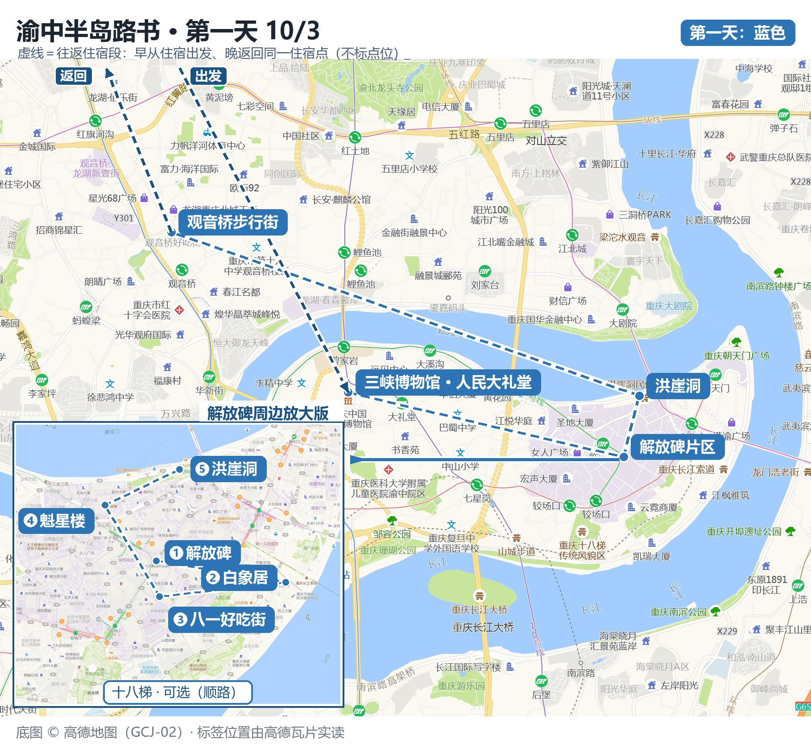

# 重庆 → 成都 4天2地旅行路书

一个手机端可直接打开的自驾/公共交通旅行路书网页：**10/3–10/6，重庆 2 天 + 成都 2 天**，含分日路线图（高德底图）、逐站时间轴、沿途天气、门票与花费、穿着建议与注意事项。

## 页面

| 文件 | 说明 |
| --- | --- |
| [`index.html`](index.html) | 4 天 2 地总路书（建议从这里开始，也是 GitHub Pages 的首页） |
| [`重庆到成都4天2地路书.html`](重庆到成都4天2地路书.html) | 同上，带语义文件名的版本 |
| [`第一天-10月3日-渝中半岛路书.html`](第一天-10月3日-渝中半岛路书.html) | 第一天《渝中半岛路书》详细页：路线地图 + 逐站时间轴；从总路书顶部「Day 1」按钮跳转 |
| [`第一天-10月3日-渝中半岛地图.jpg`](第一天-10月3日-渝中半岛地图.jpg) | 单独导出的第一天路线图，可直接发微信/存相册 |

## 行程概览

- **Day 1（10/3 周六）· 重庆渝中半岛**：住宿出发 → 三峡博物馆/人民大礼堂 → 解放碑（午餐）→ 白象居 → 八一好吃街 → 魁星楼 → 洪崖洞夜景 → 观音桥 → 返回住宿
- **Day 2（10/4 周日）· 重庆**：磁器口古镇 → 李子坝轻轨穿楼 → 鹅岭二厂 → 长江索道 → 南滨路/弹子石老街夜景 → 返回住宿
- **Day 3（10/5 周一）· 重庆 → 成都**：06:32 G8650 重庆北 → 成都东（07:48）→ 大熊猫繁育研究基地 → 宽窄巷子 → 人民公园 → 太古里/春熙路
- **Day 4（10/6 周二）· 成都 + 返程**：武侯祠 → 锦里 → 文殊院 或 杜甫草堂 → 春熙路收尾 → 成都东站/天府机场

## 地图说明

- 底图为**高德地图瓦片**（GCJ-02 坐标系），标签块位置由瓦片实读后标注，非示意画法。
- 蓝色＝第一天路线；左下角「解放碑周边放大版」按步行顺序标了 1–5，虚线框为顺路可选点。
- 主图上的**短虚线＝往返住宿段**：早从住宿出发、晚返回同一住宿点；按要求只标方向、不标住宿点位。
- 地图版权归高德地图所有，仅供个人行程使用。

## 数据来源与查询时间

| 数据 | 来源 | 查询时间 |
| --- | --- | --- |
| 天气 | Open-Meteo 全球预报（7–10 天窗口） | 2026-09-28 |
| 高铁车次与票价 | 12306 实时查询（10/3、10/5 实际车次：G8650 二等座 ¥133 等） | 2026-09-28 |
| 门票与开放时间 | 景区官方渠道 + 2026 年本地攻略（三峡博物馆免费、大礼堂 8 元、长江索道单程 30 元、熊猫基地 55 元、武侯祠 50 元） | 2026-09-28 |
| 行程底图 | 高德地图瓦片（z14–z17） | 2026-09-28 |

> 价格为查询时点的公开信息，节假日与调价可能浮动，出发前请以景区官方公众号/小程序与 12306 为准。

## 手机上怎么看

1. 用手机浏览器打开本页（微信内置浏览器可能无法唤起高德，请点右上角「···」→「在浏览器中打开」）。
2. 页面顶部 4 个按钮：**Day 1 直接跳转《渝中半岛路书》**；Day 2–4 会唤起高德地图并定位当天起点。
3. 页面本身是单文件自包含 HTML（地图与样式都内嵌），可离线打开、可转发。

## 重新生成

页面由脚本生成，数据与脚本在本地工程的 `work/` 目录：

| 脚本 | 作用 |
| --- | --- |
| `work/fetch_data.py` | 抓取天气（Open-Meteo） |
| `work/train.py` | 抓取 12306 车次与票价 |
| `work/map_build.py` | 下载并拼接高德瓦片为底图 |
| `work/draw_map.py` | 在底图上绘制标签块、路线虚线、方向箭头、放大图与图例 |
| `work/build_4day.py` / `work/embed_map.py` | 生成 4 天 2 地与第一天详细页 HTML |

重新生成顺序：`draw_map.py` → `build_roadbook.py`（路书模板）→ `embed_map.py` → `build_4day.py`。

## 待补充

- 第二天（磁器口/李子坝/南滨路）与第三天（熊猫基地/市区）还没有同款地图详细页；做好后同样替换成页面内跳转。
- 如需多人协作或在线版本，可开启 GitHub Pages：Settings → Pages → Source 选 `main` 分支根目录，访问 `https://xuzehan.github.io/Travel_Web/`。
